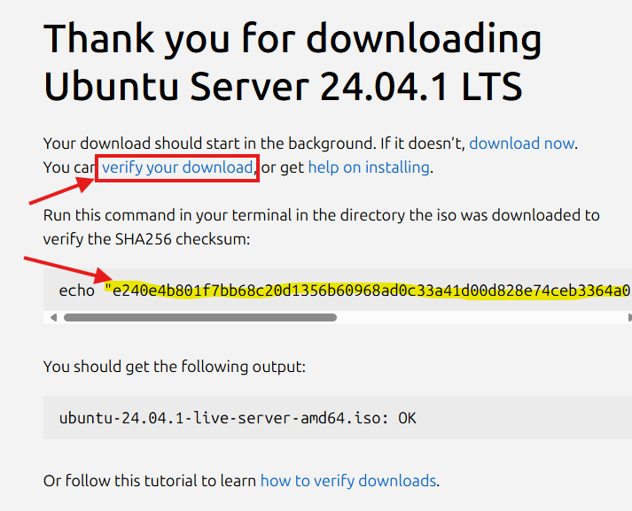

# Verifisering av ISO-fil med SHA256

## Hva er en hash?
En hash er et digitalt "fingeravtrykk" av en fil. Hvis to filer har samme hash, er de identiske. Dette brukes for å verifisere at nedlastede filer er komplette og uendrede.

## Sjekk SHA256 hash i Windows

1. Først åpner du et nytt _PowerShell_-vindu.

> _Slik åpner du PowerShell (3 alternativer):_ 
> - Åpne _PowerShell_ eller _Terminal_ fra startmenyen
> - Åpne Kjør-dialogen \[Win + r\] skriv `powershell` og trykk \[Enter\]
> - Bruk \[Win + x\] og velg _Terminal_ fra menyen som kommer opp

2. Naviger til mappen du har lastet ned filen, som
`C:\Users\[ditt_brukernavn]\Downloads` med bruk av kommandoen `cd`:

```powershell
cd C:\Users\truls\Downloads
```

3. Beregne SHA256 hash til filen, med kommando `Get-FileHash`: 

> #### _Tips_
> Begynn å skrive navnet på filen, som 'ubun' og trykk \[TAB\] tasten, 
> så fullfører _PowerShell_ filnavnet for deg. 

```powershell
Get-FileHash ubuntu-22.04-live-server-amd64.iso -Algorithm SHA256
```

## Sjekk at dette stemmer overens med HASH fra nedlastingssiden

Etter du trykker last ned på ubuntu sine sider, kan du trykke på 
'verify your download' for å vise hash-koden, som er teksten markert med
gult i bildet under:



Du kan enten kontrollere manuelt om dette stemmer overens med koden du 
genererte over, eller du kan få _PowerShell_ til å sjekke om 'fingeravtrykkene'
er like:

```powershell
(Get-FileHash .\filnavn -Algorithm SHA256).Hash -eq "hash"
```

For eksempel:

```powershell
(Get-FileHash .\ubuntu-24.04.1-live-server-amd64.iso -Algorithm SHA256).Hash -eq "e240e4b801f7bb68c20d1356b60968ad0c33a41d00d828e74ceb3364a0317be9"
```

Om `True` printes er filen verifisert, om resultatet er `False` betyr det at 
hash / fingeravtrykk til den nedlastede filen ikke er som forventet. Det kan være
at filen er skadet, eller at filen du har mottatt ikke er den filen du har
bedt om. (I noen sammenhenger kan det indikere et forsøk på et dataangrep, der
noen forsøker å gi deg en fil som utgir seg for å være trygg, men som inneholder
skadevare)

## Oppsummert
1. Last ned ISO-filen fra Ubuntu
2. Noter SHA256-hashen fra Ubuntu sin nedlastingsside
3. Kjør en av kommandoene over
4. Sammenlign hashen du får med den fra Ubuntu
   - Hvis de er identiske = filen er OK
   - Hvis de er forskjellige = last ned på nytt
