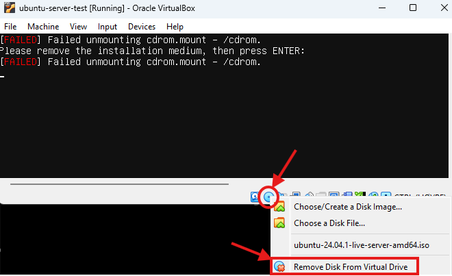

# Installasjon av Ubuntu Server - Steg for steg

Nå som du har alt klart fra [forrige del](./homelab1.2-forberedelse.md)
er det tid for å installere Ubuntu Server

## 1. Oppsett av virtuell maskin i VirtualBox

Først skal du lage en ny 'profil' for den virtuelle maskinen i VirtualBox.

### Opprett ny VM
1. Start VirtualBox og klikk "New"
2. Fyll inn basisinformasjon:
   - Name: navnet-du-ønsker
   - Folder: mappen-du-vil-lagre-vm-i
   - ISO Image: iso-filen-du-har-lastet-ned
   - Andre felt som nok fylles ut automatisk:
      - Type: Linux
      - Version: Ubuntu 64-bit
   - OBS: Velg 'Skip Unattended Installasjon'
3. Velg hardware konfigurasjon
   - Memory: 2048 MB
   - Processors: 2
4. Virtuell HDD
   - Create a virtual hard disk now
   - 25 GB
5. Velg _Finish_

### Harddisk-konfigurasjon
- Velg VDI (VirtualBox Disk Image)
- Dynamically allocated
- Size: 20 GB

### Nettverksoppsett
1. Velg VM og klikk "Settings"
2. Gå til "Network"
3. Adapter 1:
   - Enable Network Adapter
   - Attached to: Bridged Adapter
   - Velg ditt nettverkskort

## 2. Ubuntu Server installasjon

Da skal den nye virtuelle maskinen være klar til å installere
operativsystemet. Slik går du frem videre:

### Start installasjonen
1. Velg din VM og klikk "Start"
2. Velg Ubuntu Server ISO-filen, hvis den ikke allerede blir kjørt automatisk.
3. Når bootmenyen vises, velg "Try or Install Ubuntu Server"

### Grunnoppsett
1. Språkvalg:
   - Velg English

2. 'Installer Update Available'
   - Om dette kommer opp, velg 'Update to new installer'

3. Tastaturlayout
   - Velg _Norwegian_ på første linje
   - Velg gjerne _Norwegian - Norwegian (Windows)_ på andre linje

4. Velg versjon
   - Velg: _Ubuntu Server (standard)_
   - Update to new installer
   - Velg standard oppsett

### Nettverk

5. Nettverkskonfigurasjon:
   - Noter ned IP-adressen som tildeles
      - F.eks: 192.168.1.159

6. Proxy
   - La denne være blank og gå videre

7. Archive mirror
   - Behold standard og gå videre

### Disk- og brukerkonfigurasjon

7. Diskoppsett
   - Behold standard:
      - Use entire disk
   - Gå videre, velg _Continue_ ved advarsel om at info på disken slettes
   > _Merk_: Dette er en virtuell disk, og disken på datamaskinen blir ikke påvirket.

8. Ubuntu Pro
   - Velg _Skip_ og gå videre

9. Brukerkonfigurasjon
   - Sett opp primærbruker, velg egne verdier. Husk passord og brukernavn!
   ```
   Your name: [Ditt navn]
   Server name: [server-navn]
   Username: [velg brukernavn]
   Password: [passord]
   ```

### Ekstra funksjoner

10. SSH
   - Velg _Install SSH Server_ og gå videre

11. Featured Snaps
   - Ikke velg noe her, bare gå videre

### Til slutt

12. Installasjon
   - Veilederen vil nå kopiere filer og fullføre installasjonen
   - Når den er ferdig, velg _Reboot Now_

> Under restart av VM kan det være at du får opp feilmeldingen under.
> Da må du fjerne den virtuelle installasjonsdisken:
> 1. Høyreklikk på CD-ikonet nederst i VirtualBox-vinduet
> 2. Klikk på 'Remove Disk From Virtual Drive'
>     - Klikk på Force dismount hvis det kommer opp en ny advarsel.
> 3. Klikk midt i vinduet, og trykk \[Enter\] for å fortsette omstarten.
>
> 

## 3. Etter installasjon

### Første innlogging
1. Logg inn med brukernavn og passord (som valgt under installasjon)
   - Du skal nå se følgende på skjermen:
   
   ```bash
   [ditt-brukernavn]@[ditt-maskinnavn]~$
   ```

2. Kjør systemoppdatering ved å skrive inn de to kommandoene under:

   ```bash
   sudo apt update
   sudo apt upgrade
   ```

   > **Merk:** Du vil bli bedt om å skrive inn passord på ny, dette er 
   > det samme passordet som du brukte for å logge inn i forrige steg.

   - Trykk \[Enter\], evt skriv `y` og trykk \[Enter\], for å bekrefte nedlasting av
   oppdateringer.

### Verifiser nettverkstilkobling og sjekk systeminfo

Du skal nå kjøre noen enkle kommandoer for å sjekke om 
1. Sjekk nettverkstilkobling:
   
   ```bash
   ip a
   ```

   Da får du opp noe som dette:
      ```bash
      ubnt@ubuntu-server:~$ ip a
      1: lo: <LOOPBACK,UP,LOWER_UP> mtu 65536 qdisc noqueue state UNKNOWN group default qlen 1000
         link/loopback 00:00:00:00:00:00 brd 00:00:00:00:00:00
         inet 127.0.0.1/8 scope host lo
            valid_lft forever preferred_lft forever
         inet6 ::1/128 scope host noprefixroute
            valid_lft forever preferred_lft forever
      2: enp0s3: <BROADCAST,MULTICAST,UP,LOWER_UP> mtu 1500 qdisc pfifo_fast state UP group default qlen 1000
         link/ether 08:00:27:19:a5:02 brd ff:ff:ff:ff:ff:ff
         inet 192.168.11.165/24 metric 100 brd 192.168.11.255 scope global dynamic enp0s3
            valid_lft 456sec preferred_lft 456sec
         inet6 fd08:7408:744d:e74b:a00:27ff:fe19:a502/64 scope global dynamic mngtmpaddr noprefixroute
            valid_lft 1743sec preferred_lft 1743sec
         inet6 fe80::a00:27ff:fe19:a502/64 scope link
            valid_lft forever preferred_lft forever
      ```
   - Dette er en oversikt over nettverkskort og tilkoblinger til din VM
   - Noter ned ip-adressen for nettverkskortet som starter med `enp`, over er den `192.168.11.165`

   Sjekk så om VM kan nå internett:
   - Kjør kommandoen under. Trykk \[ctrl + c\] for å avslutte etter noen linjer har blitt skrevet til skjerm.

   ```bash
   ping 8.8.8.8
   ```

   - Denne kommandoen 'ping-er' googles DNS-server, altså den sender en testmelding for å se om VM kan nå
   en ekstern server.
   - Resultatet vil ligne dette:

      ```bash
      ubnt@ubuntu-server:~$ ping 8.8.8.8
      PING 8.8.8.8 (8.8.8.8) 56(84) bytes of data.
      64 bytes from 8.8.8.8: icmp_seq=1 ttl=47 time=25.7 ms
      64 bytes from 8.8.8.8: icmp_seq=2 ttl=47 time=24.9 ms
      64 bytes from 8.8.8.8: icmp_seq=3 ttl=47 time=23.8 ms
      ^C
      --- 8.8.8.8 ping statistics ---
      3 packets transmitted, 3 received, 0% packet loss, time 2002ms
      rtt min/avg/max/mdev = 23.819/24.792/25.675/0.760 ms
      ```

2. Sjekk systeminfo:
   - Kjør så denne kommandoen:

   ```bash
   hostnamectl
   ```

   Da får du opp noe lignende dette:
      ```bash
      ubnt@ubuntu-server:~$ hostnamectl
      Static hostname: ubuntu-server
            Icon name: computer-vm
               Chassis: vm 🖴
            Machine ID: bacffb8164f741c699edbb0527c45f04
               Boot ID: 7c316a855c964d5aabe3942a98b2b833
      Virtualization: oracle
      Operating System: Ubuntu 24.04.1 LTS
               Kernel: Linux 6.8.0-51-generic
         Architecture: x86-64
      Hardware Vendor: innotek GmbH
      Hardware Model: VirtualBox
      Firmware Version: VirtualBox
         Firmware Date: Fri 2006-12-01
         Firmware Age: 18y 1month 2w 6d
      ```
   - Noter ned `Static hostname`, `Operating System`, `Kernel` og `Architecture`

## Dokumentasjon

Skal inneholde:
- IP-adresse
- Brukernavn
- Hostname
- Operativsystemets versjon og kjerneversjon (kernel) samt arkitektur
- Evt problemer du støtte på
- Spørsmål og ting du lurer på

## Neste steg
Etter vellykket installasjon og verifikasjon, er du klar for å:
- Konfigurere statisk IP
- Sette opp brannmur
- Installere webserver

## Feilsøking
- Boot-problemer: Sjekk BIOS/VM-innstillinger i VirtualBox
- Nettverksproblemer: Verifiser bridged adapter i VM-innstillingene
- Installasjonsfeil: Sjekk ISO-fil og VM-ressurser